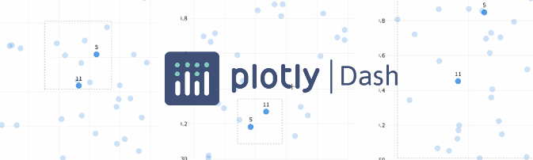

# Dash Documentation Boilerplate

> A modern, responsive documentation system for Dash applications built with Dash Mantine Components

[](https://dash.plotly.com/)
[](https://www.dash-mantine-components.com/)
[](https://www.python.org/)
[](LICENSE)

A comprehensive boilerplate for creating beautiful, interactive documentation for your Dash components, data science workflows, and applications. Features markdown-driven content, live code examples, and automatic theme persistence.



---

## ✨ Features

### 📝 Markdown-Driven Documentation
- Write documentation in Markdown with Python integration
- Custom directives for interactive examples, code highlighting, and component props
- Automatic page generation from markdown files with frontmatter metadata
- Table of contents generation for easy navigation

### 🎨 Modern UI/UX
- Built with [Dash Mantine Components](https://www.dash-mantine-components.com/)
- Responsive design for mobile, tablet, and desktop
- Dark and light theme support with **automatic preference persistence**
- Smooth transitions and professional styling
- Customizable color schemes and theming

### 🔍 Developer Experience
- Hot reload during development
- Searchable component navigation
- Syntax highlighting for multiple languages
- Interactive code examples with live callbacks
- Component props documentation auto-generation

### 🐋 Production Ready
- Docker and docker-compose support
- Gunicorn production server included
- Optimized for deployment
- Environment-based configuration

### 🚀 Built With Latest Technologies
- **Dash 3.2.0** - Modern Plotly Dash framework
- **DMC 2.4.0** - Dash Mantine Components
- **Mantine 8.3.6** - Beautiful React UI library
- **React 18** - Latest React features
- **Python 3.11+** - Modern Python

---

## 📋 Requirements

### System Requirements
- **Python**: 3.11 or higher
- **Node.js**: 14+ (for npm dependencies)
- **npm**: 6+

### Python Dependencies
- dash >= 3.0.0
- dash-mantine-components >= 2.4.0
- flask >= 3.0.0
- plotly >= 5.0.0
- pandas >= 1.2.3
- pydantic >= 2.3.0
- python-frontmatter >= 1.0.0
- markdown2dash
- gunicorn >= 21.2.0 (production)

See [`requirements.txt`](requirements.txt) for complete list.

---

## 🚀 Quick Start

### 1. Clone the Repository

```bash
git clone https://github.com/pip-install-python/Dash-Documentation-Boilerplate.git
cd Dash-Documentation-Boilerplate
```

### 2. Install Dependencies

**Python packages:**
```bash
pip install -r requirements.txt
```

**Node packages** (for DMC frontend components):
```bash
npm install
```

### 3. Run the Development Server

```bash
python run.py
```

Visit **http://localhost:8553** in your browser.

### 4. Start Documenting!

Create your documentation in the `docs` folder:

```bash
docs/
├── your-component/
│   ├── your-component.md     # Markdown documentation
│   └── examples.py           # Python code examples (optional)
```

---

## 📁 Project Structure

```
dash-documentation-boilerplate/
├── assets/                      # Static assets and CSS
│   ├── dash_documentation_boilerplate.png
│   ├── intro_img.png
│   ├── m2d.css                 # Markdown-to-Dash styling
│   └── main.css                # Custom styles
│
├── components/                  # Reusable UI components
│   ├── appshell.py             # Main app layout with MantineProvider
│   ├── header.py               # Header with search and theme toggle
│   └── navbar.py               # Navigation sidebar and drawer
│
├── docs/                        # Documentation content
│   └── example/
│       ├── example.md          # Example documentation page
│       └── introduction.py     # Example interactive component
│
├── lib/                         # Utility libraries
│   ├── constants.py            # App-wide constants
│   └── directives/             # Custom markdown directives
│       ├── kwargs.py           # Component props table generator
│       ├── source.py           # Source code display directive
│       └── toc.py              # Table of contents directive
│
├── pages/                       # Dash multi-page app pages
│   ├── home.md                 # Home page content
│   ├── home.py                 # Home page layout
│   └── markdown.py             # Dynamic markdown page loader
│
├── templates/
│   └── index.html              # Custom HTML template
│
├── .gitignore
├── CHANGELOG.md                # Version history and changes
├── Dockerfile                  # Docker container definition
├── docker-compose.yml          # Docker compose configuration
├── package.json                # Node.js dependencies
├── package-lock.json           # Locked npm versions
├── README.md                   # This file
├── requirements.txt            # Python dependencies
└── run.py                      # Application entry point
```

---

## 📖 Usage Guide

### Creating Documentation Pages

1. **Create a new folder** in the `docs/` directory:
   ```bash
   mkdir -p docs/my-component
   ```

2. **Create a markdown file** with frontmatter:
   ```markdown
   ---
   name: My Component
   description: A description of my component
   endpoint: /components/my-component
   icon: mdi:code-tags
   ---

   ## My Component

   Your documentation content here...
   ```

3. **Add interactive examples** (optional):
   ```python
   # docs/my-component/example.py
   import dash_mantine_components as dmc

   component = dmc.Button("Click Me!", id="my-button")
   ```

4. **Use directives** in your markdown:
   ```markdown
   .. toc::

   .. exec::docs.my-component.example

   .. source::docs/my-component/example.py
   ```

### Custom Markdown Directives

#### `.. toc::`
Generates a table of contents from your markdown headings.

#### `.. exec::module.path.to.component`
Renders an executable Python component from a module.

#### `.. source::path/to/file.py`
Displays source code with syntax highlighting.

#### `.. kwargs::ComponentName`
Generates a props documentation table for a component.

### Customizing Themes

Modify `lib/constants.py` to change the primary color:

```python
PRIMARY_COLOR = "teal"  # Change to any Mantine color
```

Customize CSS in:
- `assets/main.css` - General styling
- `assets/m2d.css` - Markdown-specific styling

### Theme Persistence

The boilerplate automatically saves user theme preference (light/dark) in localStorage:
- First visit: Detects browser preference or defaults to light
- Theme toggle: Saves preference automatically
- Return visits: Restores saved theme preference

---

## 🐳 Docker Deployment

### Build the Docker Image

```bash
docker build -t dash-docs-boilerplate .
```

### Run with Docker

```bash
docker run -p 8550:8550 dash-docs-boilerplate
```

Visit **http://localhost:8550**

### Using Docker Compose

```bash
docker-compose up
```

The app will be available at **http://localhost:8550**

### Production Deployment

The Docker container uses **Gunicorn** for production-ready serving:
- Multiple workers for better performance
- Automatic worker restart on failure
- Suitable for production environments

---

## 🛠️ Development

### Setting Up Development Environment

1. **Create virtual environment**:
   ```bash
   python -m venv .venv
   source .venv/bin/activate  # On Windows: .venv\Scripts\activate
   ```

2. **Install dependencies**:
   ```bash
   pip install -r requirements.txt
   npm install
   ```

3. **Run in debug mode**:
   ```python
   # Modify run.py
   app.run(debug=True, host='0.0.0.0', port='8553')
   ```

### Adding New Components

1. Create your component in a separate module
2. Add documentation in `docs/your-component/`
3. The app automatically discovers and registers pages from markdown files
4. Restart the server to see your new documentation

### Modifying the Layout

Main layout components:
- **Header**: `components/header.py` - Logo, search, theme toggle
- **Navbar**: `components/navbar.py` - Sidebar navigation
- **AppShell**: `components/appshell.py` - Overall layout structure

---

## 🔧 Configuration

### Environment Variables

Create a `.env` file (optional):

```env
DASH_DEBUG=False
DASH_HOST=0.0.0.0
DASH_PORT=8553
```

### Customization Points

| File | Purpose |
|------|---------|
| `lib/constants.py` | App-wide constants (colors, titles) |
| `assets/main.css` | Custom CSS styles |
| `templates/index.html` | HTML template (for analytics, meta tags) |
| `components/appshell.py` | Theme configuration, MantineProvider settings |

---

## 📚 Documentation

### User Documentation
- **Getting Started**: This README
- **Changelog**: See [CHANGELOG.md](CHANGELOG.md)
- **Examples**: Check the `/docs/example/` folder

### Migration Guides
If upgrading from an older version, see:
- [Migration README](MIGRATION_README.md) - Quick start
- [Migration Checklist](MIGRATION_CHECKLIST.md) - Step-by-step guide
- [Code Changes Summary](CODE_CHANGES_SUMMARY.md) - Detailed code changes

---

## 🤝 Contributing

Contributions are welcome! Here's how you can help:

1. **Fork the repository**
2. **Create a feature branch**: `git checkout -b feature/amazing-feature`
3. **Make your changes**
4. **Test thoroughly**: Ensure the app runs without errors
5. **Commit your changes**: `git commit -m 'Add amazing feature'`
6. **Push to the branch**: `git push origin feature/amazing-feature`
7. **Open a Pull Request**

### Development Guidelines

- Follow PEP 8 style guide for Python code
- Add docstrings to functions and classes
- Test your changes before submitting
- Update documentation if adding new features
- Keep commits atomic and well-described

---

## 🐛 Known Issues & Troubleshooting

### Common Issues

**Issue**: `ModuleNotFoundError: No module named 'dash_html_components'`
- **Solution**: You're using an old version. Update to 0.2.0+ which uses Dash 3.x

**Issue**: Theme doesn't persist
- **Solution**: Check browser localStorage is enabled and not blocked

**Issue**: npm install fails
- **Solution**: Update Node.js to 14+ and npm to 6+

**Issue**: Port already in use
- **Solution**: Change port in `run.py` or stop the conflicting process

For more issues, check [GitHub Issues](https://github.com/pip-install-python/Dash-Documentation-Boilerplate/issues)

---

## 📊 Version Information

**Current Version**: 0.2.0

| Component | Version |
|-----------|---------|
| Dash | 3.2.0 |
| Dash Mantine Components | 2.4.0 |
| Mantine | 8.3.6 |
| Python | 3.11.8+ |
| React | 18.2.0 |
| Flask | 3.1.2 |

See [CHANGELOG.md](CHANGELOG.md) for version history.

---

## 📜 License

This project is licensed under the MIT License - see the [LICENSE](LICENSE) file for details.

---

## 🙏 Acknowledgments

### Built With
- [Plotly Dash](https://dash.plotly.com/) - The web framework
- [Dash Mantine Components](https://www.dash-mantine-components.com/) - Beautiful UI components
- [Mantine](https://mantine.dev/) - React component library

### Inspired By
- [dmc-docs](https://github.com/snehilvj/dmc-docs) - Documentation framework inspiration

### Special Thanks
- [@AnnMarieW](https://github.com/AnnMarieW) for suggested improvements
- The Dash community for continuous support

---

## 📞 Support & Community

### Get Help
- **Documentation**: You're reading it!
- **Issues**: [GitHub Issues](https://github.com/pip-install-python/Dash-Documentation-Boilerplate/issues)
- **Discussions**: [GitHub Discussions](https://github.com/pip-install-python/Dash-Documentation-Boilerplate/discussions)
- **Dash Community**: [Plotly Community Forum](https://community.plotly.com/)

### Stay Connected

**GitHub**: [@pip-install-python](https://github.com/pip-install-python)


**YouTube**: [Pip Install Python](https://www.youtube.com/channel/UC-pBvv8mzLpj0k-RIbc2Nog?sub_confirmation=1)


---

## 🚀 What's Next?

### Roadmap
- [ ] Additional markdown directives
- [ ] Component search with fuzzy matching
- [ ] Auto-generated API documentation from docstrings
- [ ] Multi-language support
- [ ] PDF export functionality
- [ ] More theme options and customization

### Want to Contribute?
Check out open issues labeled [`good first issue`](https://github.com/pip-install-python/Dash-Documentation-Boilerplate/labels/good%20first%20issue)

---

<div align="center">

**[⬆ Back to Top](#dash-documentation-boilerplate)**

Made with ❤️ by the Dash community

**Star this repo** if you find it useful! ⭐

</div>
